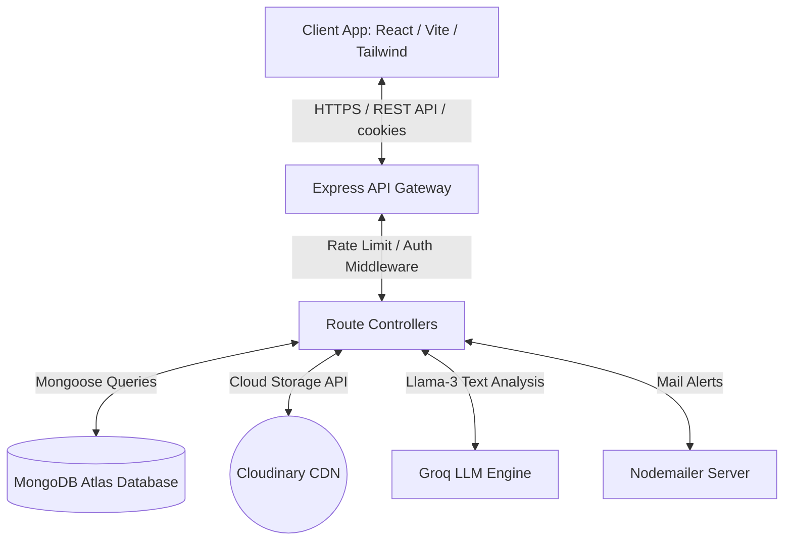
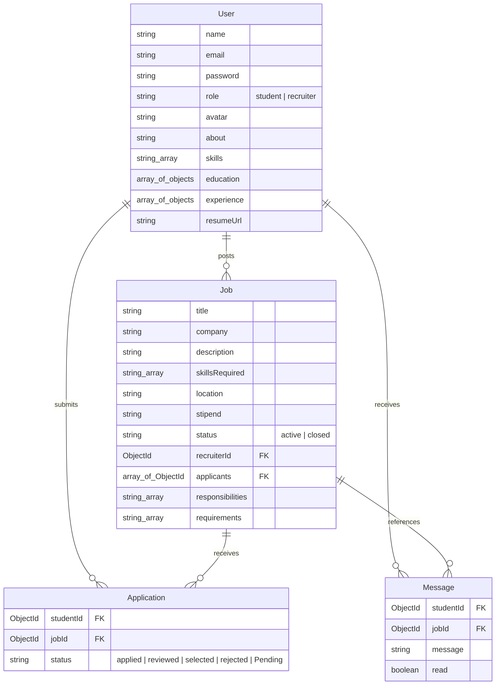
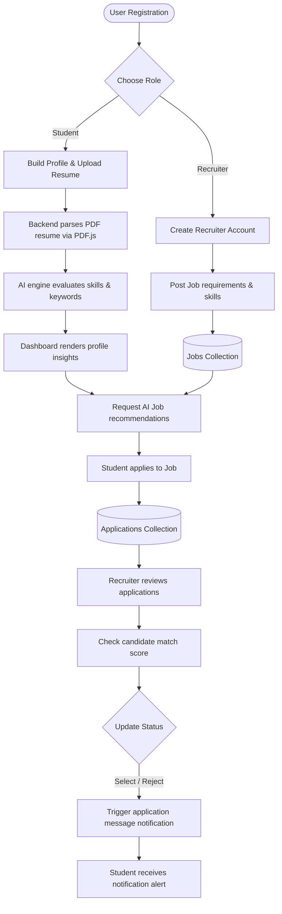
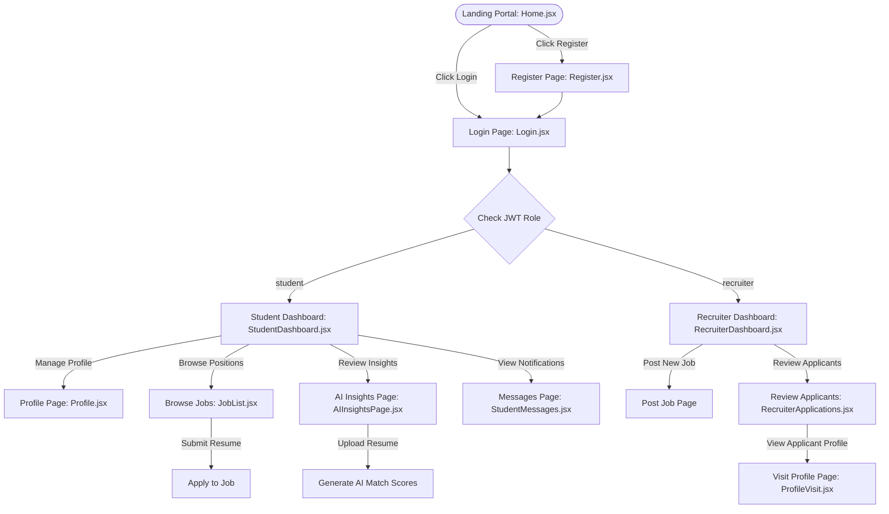

<!-- Beautiful Banner -->
<p align="center">
  
</p>

<!-- Animated Typing Effect -->
<p align="center">
  <a href="https://git.io/typing-svg">
    
  </a>
</p>

<!-- Badges -->
<p align="center">
  <a href="https://github.com/Suman-Kumar-Sahu/GrowStudy/stargazers">
    
  </a>
  <a href="https://github.com/Suman-Kumar-Sahu/GrowStudy/network/members">
    
  </a>
  <a href="https://github.com/Suman-Kumar-Sahu/GrowStudy/issues">
    
  </a>
  <a href="https://github.com/Suman-Kumar-Sahu/GrowStudy/blob/main/LICENSE">
    
  </a>
  <a href="https://github.com/Suman-Kumar-Sahu/GrowStudy/commits/main">
    
  </a>
  <a href="https://github.com/Suman-Kumar-Sahu/GrowStudy">
    
  </a>
  <a href="https://github.com/Suman-Kumar-Sahu/GrowStudy">
    
  </a>
  <a href="https://github.com/Suman-Kumar-Sahu/GrowStudy">
    
  </a>
</p>

---

## 📌 Table of Contents

- [📖 About Project](#-about-project)
- [✨ Features](#-features)
- [💻 Tech Stack](#-tech-stack)
- [📐 Architecture Diagram](#-architecture-diagram)
- [📂 Folder Structure](#-folder-structure)
- [📸 Screenshots & Demos](#-screenshots--demos)
- [🚀 Live Demo](#-live-demo)
- [⚙️ Installation Guide](#%EF%B8%8F-installation-guide)
- [🔒 Environment Variables](#-environment-variables)
- [🔌 API Endpoints](#-api-endpoints)
- [🗄️ Database Schema](#%EF%B8%8F-database-schema)
- [📊 Workflow Diagram](#-workflow-diagram)
- [🔄 Sequence Diagram](#-sequence-diagram)
- [🛣️ Screens Flow](#%EF%B8%8F-screens-flow)
- [⚡ Performance Features](#-performance-features)
- [🛡️ Security Implementation](#%EF%B8%8F-security-implementation)
- [🧪 Testing](#-testing)
- [☁️ Deployment](#%EF%B8%8F-deployment)
- [🔮 Future Improvements](#-future-improvements)
- [🗺️ Roadmap](#%EF%B8%8F-roadmap)
- [🤝 Contributing](#-contributing)
- [🎨 Code Style](#-code-style)
- [📞 Support](#-support)
- [✍️ Author](#%EF%B8%8F-author)
- [📄 License](#-license)
- [🙏 Acknowledgements](#-acknowledgements)
- [📈 GitHub Statistics](#-github-statistics)

---

## 📖 About Project

**GrowStudy (CareerNest)** is a next-generation career portal and AI-powered job application system. Standard job boards offer static listings, leaving candidates uncertain if their resumes align with role requirements. GrowStudy bridges this gap by embedding Generative AI directly into the recruitment lifecycle.

### Why it Exists & Problem Solved
- **The Gap:** Job seekers struggle to customize resumes for varying job specifications, resulting in high rejection rates.
- **The Solution:** GrowStudy utilizes the **Groq LLM API** to parse candidate resumes (uploaded securely to Cloudinary) and compare them in real time against job postings.
- **Main Goal:** Demystify the recruitment process by giving students immediate match scores, keyword gap analyses, and tailored career recommendations while giving recruiters an structured portal to post positions and manage applications.
- **Key Benefits:** Reduces time-to-apply, improves applicant quality, provides immediate career advice, and eliminates manual resume filtering bottlenecks.

---

## ✨ Features

- **🔐 Secure Authentication:** Role-based access control (RBAC) separating `student` and `recruiter` dashboards via secure HttpOnly JWT cookies.
- **📄 Resume Parse & Analysis:** Seamlessly upload resumes (PDF/DOCX) to Cloudinary, parse text content on the backend, and get structural score feedback.
- **🧠 AI Match Score:** Generates matching percentages, matching strengths, gaps, and resume modification suggestions relative to specific job applications.
- **💼 Job Postings & Management:** Recruiters can publish, edit, deactivate, and view candidate applications for their posted jobs.
- **🔍 Advanced Search & Filter:** Search jobs by keywords with optimized debounced inputs, location, and stipend sorting.
- **💬 Real-Time Notification System:** Tracks application status changes (applied, reviewed, selected, rejected) and alerts students.
- **📱 Premium Responsive Interface:** Dark-mode dashboard layout designed with modern CSS variable systems and clamp functions.
- **⚡ Token Bucket Rate Limiting:** Dynamic API rate limiting configured via custom middleware to defend endpoints against abuse.

---

## 💻 Tech Stack

### Technology Badges
<p align="left">
  
  
  
  
  
  
  
  
  
  
  
</p>

### Architecture Table
| Layer | Technologies Used | Description |
| :--- | :--- | :--- |
| **Frontend** | React 19, Vite, Tailwind CSS v4, Lucide React, React Router DOM, React Toastify | High-performance SPA with memoized custom hooks, clean skeleton loaders, and responsive CSS clamp styling. |
| **Backend** | Node.js, Express, Multer, PDF.js, Groq Cloud SDK | Modular REST API featuring custom Token Bucket rate limiters, schema validations, and automated pipeline integration. |
| **Database** | MongoDB, Mongoose | NoSQL database storing user profiles, structured job requirements, applications, and logs. |
| **Cloud Storage** | Cloudinary CDN | Cloud media management for secure avatars and candidate resume PDFs. |
| **Tooling** | Axios, ESLint, Zod schemas, Nodemailer, BcryptJS, Dotenv | Schema parsing, robust cryptographic hashing, background mail updates, and linting standards. |

---

## 📐 Architecture Diagram



---

## 📂 Folder Structure

```text
GrowStudy/
├── Backend/                    # Node.js Server Code
│   ├── public/                 # Local uploads temp directory
│   │   ├── resume/
│   │   └── temp/
│   ├── src/
│   │   ├── controllers/        # Express handlers (AI, Auth, User, Job, App)
│   │   ├── db/                 # Mongoose Connection setup
│   │   ├── middleares/         # Auth, Rate Limiter (Token Bucket), Validation middlewares
│   │   ├── models/             # User, Job, Application, Message Schemas
│   │   ├── routes/             # Route mapping definitions
│   │   ├── utils/              # Cloudinary uploader, NodeMailer helper
│   │   └── validation/         # Zod schemas for input validation
│   ├── .env
│   ├── app.js                  # App assembly & configuration
│   ├── package.json
│   └── server.js               # Entry point
├── Frontend/                   # Client Application
│   └── GrowStudyClient/
│       ├── public/
│       ├── src/
│       │   ├── api/            # Axios API config with credentials
│       │   ├── componets/      # Reusable UI parts & AI visualization cards
│       │   ├── context/        # React Global contexts (Auth, AI, Toast)
│       │   ├── layout/         # Base structure views
│       │   ├── pages/          # Auth pages, Dashboards, AI Insights, Profile
│       │   ├── routes/         # Routing configs
│       │   ├── styles/         # Custom color models and variables
│       │   ├── App.jsx
│       │   └── main.jsx
│       ├── eslint.config.js
│       ├── package.json
│       └── vite.config.js
```

---

## 📸 Screenshots & Demos

### Interface Previews
<p align="center">
  <b>Home Portal Landing</b><br>
  
</p>

<p align="center">
  <b>AI Career Insights Dashboard</b><br>
  
</p>

<p align="center">
  <b>Interactive Candidate Match Matrix</b><br>
  
</p>

---

## 📹 GIF Demo

<p align="center">
  
</p>

---

## 🚀 Live Demo

<p align="center">
  <a href="https://growstudy.vercel.app">
    
  </a>
  <a href="https://github.com/Suman-Kumar-Sahu/GrowStudy">
    
  </a>
  <a href="https://github.com/Suman-Kumar-Sahu/GrowStudy/wiki/API-Documentation">
    
  </a>
</p>

---

## ⚙️ Installation Guide

Follow these steps to set up GrowStudy locally.

### Prerequisites
- Node.js installed (v18 or higher recommended)
- MongoDB account (local or MongoDB Atlas)
- Cloudinary developer API account
- Groq Cloud API key

### 1. Clone the Repository
```bash
git clone https://github.com/Suman-Kumar-Sahu/GrowStudy.git
cd GrowStudy
```

### 2. Configure the Backend
Navigate to the backend directory, install packages, and create your environment variables file.
```bash
cd Backend
npm install
```
Create a `.env` file in the `Backend` directory:
```env
PORT=3000
MONGODB_URI=your_mongodb_connection_string
JWT_SECRET=your_jwt_signing_secret
CLOUDINARY_CLOUD_NAME=your_cloud_name
CLOUDINARY_API_KEY=your_cloudinary_api_key
CLOUDINARY_API_SECRET=your_cloudinary_api_secret
GROQ_API_KEY=your_groq_api_key
SMTP_HOST=your_smtp_host
SMTP_PORT=your_smtp_port
SMTP_USER=your_smtp_user
SMTP_PASS=your_smtp_pass
FRONTEND_URL=http://localhost:5173
```
Run database migrations/indexes and start the local development server:
```bash
npm run start
```

### 3. Configure the Frontend
Open a new terminal window, navigate to the client workspace, install components, and start Vite's HMR server.
```bash
cd ../Frontend/GrowStudyClient
npm install
```
Create a `.env` file in `Frontend/GrowStudyClient`:
```env
VITE_API_URL=http://localhost:3000/api
```
Run the local dev server:
```bash
npm run dev
```

---

## 🔒 Environment Variables

| Variable Name | Description | Placement | Required |
| :--- | :--- | :--- | :--- |
| `PORT` | Local network binding port for Node server | Backend | Yes (default 3000) |
| `MONGODB_URI` | Full connection URI (with login credentials) for MongoDB | Backend | Yes |
| `JWT_SECRET` | Secret key used to sign HTTP HTTPOnly authorization tokens | Backend | Yes |
| `CLOUDINARY_CLOUD_NAME` | Target cloud namespace for avatar/PDF uploads | Backend | Yes |
| `CLOUDINARY_API_KEY` | Public key credentials for Cloudinary API | Backend | Yes |
| `CLOUDINARY_API_SECRET` | Private secret signature key for Cloudinary API | Backend | Yes |
| `GROQ_API_KEY` | Platform token for Groq API Cloud model processing | Backend | Yes |
| `FRONTEND_URL` | Host origin address for CORS verification limits | Backend | Yes |
| `VITE_API_URL` | Endpoint path mapping directory target for Axios | Frontend | Yes |

---

## 🔌 API Endpoints

<details>
<summary>🔑 Click to Expand Authentication Endpoints</summary>

| Method | Endpoint | Description | Auth Requirement |
| :--- | :--- | :--- | :--- |
| `POST` | `/api/auth/user/register` | Registers client credentials and registers profile structure. | None (Public) |
| `POST` | `/api/auth/user/login` | Validates client credentials, issues JWT HttpOnly token. | None (Public) |
| `POST` | `/api/auth/user/logout` | Clears local context cookie and destroys session reference. | None (Public) |
| `GET` | `/api/auth/user/me` | Fetches session validation state and user profile fields. | Token validation |

</details>

<details>
<summary>👤 Click to Expand User Profile Endpoints</summary>

| Method | Endpoint | Description | Auth Requirement |
| :--- | :--- | :--- | :--- |
| `GET` | `/api/users/profile` | Reads full profile parameters for the logged-in user. | Token validation |
| `GET` | `/api/users/profile/:id` | Reads profile elements of a specific candidate (Visitor/Recruiter access). | Token validation |
| `PUT` | `/api/users/profile` | Updates dynamic resume fields, skills, work history, and education. | Token validation |
| `POST` | `/api/users/upload-resume` | Uploads PDF/Word file to Cloudinary and saves URL in model. | Token validation |
| `POST` | `/api/users/upload-avatar` | Uploads profile photo to Cloudinary and saves avatar path. | Token validation |

</details>

<details>
<summary>💼 Click to Expand Job Endpoints</summary>

| Method | Endpoint | Description | Auth / Role |
| :--- | :--- | :--- | :--- |
| `GET` | `/api/jobs` | Fetches active listed jobs matching criteria filters. | None (Public) |
| `GET` | `/api/jobs/:id` | Returns complete details for a single job posting. | None (Public) |
| `GET` | `/api/jobs/recruiter` | Retrieves all postings published by the current Recruiter. | Recruiter role |
| `POST` | `/api/jobs` | Creates a new job posting. | Recruiter role |
| `PUT` | `/api/jobs/:id` | Updates parameters of a posted job. | Recruiter role |
| `DELETE` | `/api/jobs/:id` | Deactivates or removes a job listing from the database. | Recruiter role |
| `POST` | `/api/jobs/:id/apply` | Files a new job application linking student and job ID. | Student role |

</details>

<details>
<summary>🧠 Click to Expand AI Insight Endpoints</summary>

| Method | Endpoint | Description | Auth / Role |
| :--- | :--- | :--- | :--- |
| `GET` | `/api/ai/analyze-resume` | Parses resume PDF and evaluates candidate skills via AI. | Student role |
| `GET` | `/api/ai/recommend-jobs` | Matches parsed skills against jobs database for recommendations. | Student role |
| `GET` | `/api/ai/match-score/:jobId` | Calculates match percentage & gap analysis for a specific job. | Student role |
| `GET` | `/api/ai/batch-match-scores` | Calculates batch match scores for all applications. | Student role |

</details>

---

## 🗄️ Database Schema



---

## 📊 Workflow Diagram



---

## 🔄 Sequence Diagram

```mermaid
sequenceDiagram
    autonumber
    actor Student
    participant Frontend
    participant Backend
    participant Cloudinary
    participant GroqAPI
    database DB as MongoDB

    Student->>Frontend: Select & Upload PDF Resume
    Frontend->>Backend: POST /api/users/upload-resume (FormData)
    Backend->>Cloudinary: Send file buffer
    Cloudinary-->>Backend: Return secure URL
    Backend->>DB: Save resumeUrl in User document
    Backend-->>Frontend: Return upload success
    Frontend->>Backend: GET /api/ai/analyze-resume
    Backend->>DB: Fetch user profile data & resume URL
    Backend->>Backend: Read PDF content via PDF.js
    Backend->>GroqAPI: Request analysis with resume text & prompts
    GroqAPI-->>Backend: Return JSON (skills, strengths, gaps)
    Backend-->>Frontend: Return structured AI insights
    Frontend->>Student: Render visual metrics & suggestions
```

---

## 🛣️ Screens Flow



---

## ⚡ Performance Features

- **⏱️ Token Bucket Rate Limiting:** Implements a dynamic token bucket algorithm (`TBRateLimiter.js`) ensuring traffic spikes do not overwhelm resources while preserving normal usage profiles.
- **🛡️ Request Debouncing:** Frontend job lookup components incorporate debouncing, reducing API server loads by preventing queries on every keystroke.
- **📦 Memoized Layout Renderings:** Key visualization components (`ResumeAnalysisCard`, charts) use memoization patterns to prevent performance-degrading re-renders.
- **📁 Cloud CDN Asset Delivery:** Offloads storage overhead from the Node application by distributing candidate resumes and profile avatars globally via Cloudinary's content delivery network.
- **⚡ Async I/O File Deletions:** Temportary local disk file buffers are cleaned asynchronously inside backend routes, preventing execution blocking.

---

## 🛡️ Security Implementation

- **🍪 HttpOnly JWT Cookies:** Session tokens are encrypted and transmitted inside strict HttpOnly cookies, protecting sessions against Cross-Site Scripting (XSS) hijacking.
- **🛡️ Custom Token Bucket Middleware:** Implemented dynamic rate limiters protecting authentication routes `/api/auth/*` and intensive API processors `/api/ai/*` to mitigate DDoS and brute force scenarios.
- **🛡️ Schema Validation:** Uses **Zod** models to filter and validate incoming payloads on the backend before writing database updates, avoiding script injections.
- **⚠️ Mass Assignment Protection:** Controller routes explicitly structure database updates by destructuring payload keys, avoiding data corruption vulnerabilities.
- **🔒 Environment Isolation:** Secret keys, database routes, and cloud tokens are strictly isolated in configuration environments.

---

## 🧪 Testing

GrowStudy includes setup hooks for unit testing, style checking, and type validation.

### Run Linter (ESLint)
Verify code conventions and formatting flags:
```bash
# In frontend directory
npm run lint
```

### Run Unit Tests
```bash
# In backend directory
npm test
```

### Code Style Checking
Ensure standard formatting rules are adhered to:
```bash
npx prettier --check .
```

---

## ☁️ Deployment

### 1. Backend Deployment on Render
1. Create a new Web Service on Render.
2. Link your GitHub repository.
3. Configure settings:
   - **Environment:** `Node`
   - **Build Command:** `npm install`
   - **Start Command:** `node server.js`
4. Add all environment keys listed in the [Environment Variables](#-environment-variables) section under **Environment Variables** in Render settings.
5. Set `NODE_ENV=production` and deploy.

### 2. Frontend Deployment on Vercel
1. Install the Vercel CLI or import the project directly via the Vercel Dashboard.
2. Select the `Frontend/GrowStudyClient` directory.
3. Configure build settings:
   - **Framework Preset:** `Vite`
   - **Build Command:** `npm run build`
   - **Output Directory:** `dist`
4. Set the environment variable:
   - `VITE_API_URL` = `https://your-backend-render-url.onrender.com/api`
5. Click **Deploy**.

---

## 🔮 Future Improvements

- [ ] **Real-time Messaging:** Build direct web socket (Socket.io) messaging channels between recruiters and candidates.
- [ ] **AI-Powered Interview Prep:** Implement a virtual mock interview platform utilizing Groq to query candidates on listed resume skills.
- [ ] **Enhanced Rate Limiting:** Move local token bucket counts to a Redis cluster, allowing scaling across multiple server instances.
- [ ] **PDF Export Reports:** Allow recruiters to export candidate match scores, skills breakdown, and recommendations as PDF reports.
- [ ] **GitHub Action Workflows:** Introduce CI pipelines for automated lint validations and tests on pull requests.

---

## 🗺️ Roadmap

```text
  Phase 1: Basic MERN Portal Setup & Authentication ✅
  Phase 2: Cloud Storage integration & Resume uploads ✅
  Phase 3: Groq LLM integration & AI insights engine ✅
  Phase 4: Global rate limiting & Request validation implementation ✅
  Phase 5: WebSocket messaging & Interview Simulation (In Progress) ⏳
```

---

## 🤝 Contributing

Contributions make the open-source community an amazing place to learn, inspire, and create. Any contributions you make are **greatly appreciated**.

1. Fork the Project.
2. Create your Feature Branch (`git checkout -b feature/AmazingFeature`).
3. Commit your Changes (`git commit -m 'Add some AmazingFeature'`).
4. Push to the Branch (`git push origin feature/AmazingFeature`).
5. Open a Pull Request.

---

## 🎨 Code Style

We follow standard web coding guidelines to maintain readability and clean project status:
- **Linting:** Configured using ESLint with strict React and Node configurations.
- **Formatting:** Checked via Prettier.
- **Commits:** We follow Conventional Commits guidelines (e.g. `feat: add job recommendations`, `fix: database connection handler`).

---

## 📞 Support

If you have any feedback or find any issues, please feel free to reach out to us:
- **GitHub Issues:** [Open a Ticket](https://github.com/Suman-Kumar-Sahu/GrowStudy/issues)
- **Author Email:** sumankumarsahu.work@gmail.com
- **Portfolio:** [sumansahu.dev](https://sumansahu.dev)

---

## ✍️ Author

**Suman Kumar Sahu**

- GitHub: [@Suman-Kumar-Sahu](https://github.com/Suman-Kumar-Sahu)
- LinkedIn: [Suman Kumar Sahu](https://linkedin.com/in/suman-kumar-sahu)
- Portfolio: [sumansahu.dev](https://sumansahu.dev)

---

## 📄 License

Distributed under the MIT License. See `LICENSE` for more information.

---

## 🙏 Acknowledgements

- [Groq API documentation](https://console.groq.com) for their high-speed inference endpoints.
- [Mongoose Docs](https://mongoosejs.com) for database modeling patterns.
- [Vite JS](https://vite.dev) for frontend hot module replacement setup.
- [Shields.io](https://shields.io) for their custom badge generator engine.

---

## 📈 GitHub Statistics

<p align="center">
  
  &nbsp;&nbsp;
  
</p>

<p align="center">
  
  &nbsp;&nbsp;
  
</p>

---

## 💡 Random Developer Quote

> "First, solve the problem. Then, write the code." — *John Johnson*

---

<!-- Footer -->
<p align="center">
  
  <br />
  Made with ❤️ by <a href="https://github.com/Suman-Kumar-Sahu">Suman Kumar Sahu</a>
</p>
