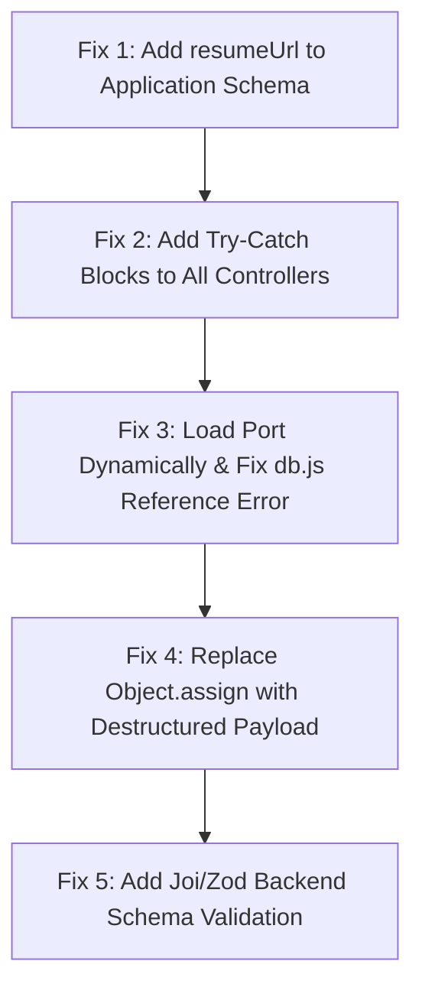

# Full-Stack Project Review: GrowStudy (CareerNest)

This is a comprehensive, production-level code review of the **GrowStudy (CareerNest)** job portal application. The review assesses both frontend (React/Vite) and backend (Node.js/Express/MongoDB) layers for deployment readiness, security, code quality, and architectural integrity.

---

## Verdict & Ratings

### Final Verdict: **PARTIALLY READY**

> [!WARNING]
> While the core business logic (job listings, profile updates, and the newly optimized AI Career Insights integration) is functional, the project cannot be deployed in its current state. Multiple critical bugs—such as a database schema desync that drops submitted resumes, lack of try-catch blocks in route controllers that will crash the server on invalid inputs, and a server port reference error—would lead to immediate production instability and crashes under moderate load.

### Ratings (Relative to Junior Developer/Internship Expectations)
* **Internship-Level Quality Rating:** **5.5 / 10** (Solid features, but lacks robustness and production essentials)
* **Production Readiness:** **3.0 / 10** (Highly vulnerable to crashes, mass assignment, and data drops)
* **Code Quality:** **5.0 / 10** (Readable but suffers from poor error handling and spelling typos)
* **UI/UX Quality:** **7.0 / 10** (Modern dark-mode aesthetic with custom css variables and clean skeleton states, though missing edge-case handling)

---

## The Good (What is Built Well)
1. **Optimized AI request flow:** The frontend now prevents redundant, failing API calls to `/ai/*` when a user has no resume. The inline resume upload card is a high-value, friction-free UX pattern.
2. **State Management & Memoization:** Reusable components like `ResumeAnalysisCard` correctly use React memoization (`React.memo`) to avoid unnecessary re-renders.
3. **Structured API responses:** Backend controllers consistently return clean JSON objects containing `success: true/false`, a descriptive `message`, and `data` objects, which simplifies frontend consumption.
4. **Cloudinary Integration:** Image thumbnails and resume storage are set up to handle CDN offloading out-of-the-box.

---

## Critical Bugs (Will Break in Production)

### 1. Database Schema Desync (Silent Data Loss)
In `jobController.js` (applyJob, line 108):
```javascript
const application = await Application.create({
  studentId: req.user._id,
  jobId: job._id,
  resumeUrl: student.resumeUrl, // <-- Field does not exist in schema!
  status: "Pending",
});
```
However, in `Application.models.js`:
```javascript
const applicationSchema = new mongoose.Schema({
  studentId: { type: mongoose.Schema.Types.ObjectId, ref: "User", required: true },
  jobId: { type: mongoose.Schema.Types.ObjectId, ref: "Job", required: true },
  status: { type: String, enum: ["applied", "reviewed", "selected", "rejected","Pending"], default: "Pending" },
}, { timestamps: true });
```
**Impact:** Mongoose silently filters out undefined fields on document creation. The `resumeUrl` is **never saved** to the Application in the database. When recruiters try to view applications, they will see a blank resume field or be forced to view the user's current live profile (which might have changed or been deleted).

### 2. Silent Crash Turned ReferenceError
In `Backend/src/db/db.js`:
```javascript
const connectDB = async() => {
    try {
        await mongoose.connect(process.env.MONGODB_URI);
    } catch (error) {
        console.log("MongoDB Error:", err); // <-- ReferenceError: err is not defined
    }
}
```
**Impact:** If MongoDB connection fails (IP whitelist restriction, DNS timeout, invalid credentials), the server attempts to handle the error but throws a `ReferenceError: err is not defined` because the caught variable is named `error`, not `err`. This crashes the process during error handling.

### 3. Server Startup Port Confusion & Wrong Callback Signature
In `Backend/server.js`:
```javascript
connectDB()
.then(()=>{
    app.listen(3000,(req,res)=>{ // <-- Typo: listen callbacks do not receive req, res
        console.log("Server is running at port 4000") // <-- Port misstatement
    })
})
```
**Impact:** 
- It listens on hardcoded port `3000` but logs that it's running on `4000`.
- The port is hardcoded to `3000` instead of reading `process.env.PORT || 3000`. In hosting environments (Render, Heroku, AWS), the provider allocates ports dynamically. Hardcoding `3000` will cause deployment failure.

### 4. Missing try/catch Blocks (API Server Crash Vulnerability)
- In `authController.js` (loginUser, line 51): If the database times out or throws an error during `User.findOne`, the application crashes because there is no try-catch or global async error wrapper.
- In `userController.js` (getProfileVisit, line 11):
  ```javascript
  export const getProfileVisit = async (req, res) => {
    const user = await User.findById(req.params.id); // <-- Will crash on invalid ObjectId format
    res.json(user);
  };
  ```
  If a client requests a URL with an invalid MongoDB ID structure (e.g. `/profile/123`), `findById` throws a `CastError`. Lacking a try-catch, this triggers an unhandled promise rejection and crashes the entire server.

---

## Architectural & Design Weaknesses (Beginner-Level Tells)

### 1. Folder Spelling Typos
The folder for middlewares is spelled `middleares` (`Backend/src/middleares`), and components is spelled `componets` (`Frontend/GrowStudyClient/src/componets`). Spellings like these in import paths (`import { PageLoader } from "../componets/ui/Loader.jsx"`) indicate a lack of basic codebase polish.

### 2. Mass Assignment Security Vulnerability (Over-privilege)
In `jobController.js` (updateJob, line 58):
```javascript
Object.assign(job, req.body);
await job.save();
```
**Why it's bad:** Passing the raw `req.body` to `Object.assign` allows users to manipulate restricted fields. A recruiter could alter `recruiterId`, `applicants`, or creation timestamps by appending them to the request body.

### 3. Absolute Lack of Input Validation
There is no input validation framework (like Joi, Zod, or Express-Validator) on the backend.
- Job postings (`createJob`) write `req.body` directly to MongoDB. A job can be saved with empty strings for title, description, or requirements.
- Register endpoints do not validate email patterns or enforce strong password policies.

### 4. Non-Production Cookie Configurations
In `authController.js`, cookies are signed and configured with:
```javascript
res.cookie("token", token, {
  secure: false, // <-- Set to false
  sameSite: "lax"
});
```
In a production HTTPS environment, `secure: false` allows token transmission over plaintext HTTP, opening the door to session hijacking. The cookie options must dynamically set `secure: process.env.NODE_ENV === "production"`.

---

## Section-by-Section Evaluation

| Review Area | Rating | Critical Feedback / Observations |
| :--- | :---: | :--- |
| **Frontend Structure** | **6/10** | Good separation of pages and components, but folder typos (`componets`) should be fixed. Layout components could use cleaner responsive flex wraps. |
| **Backend/API Design** | **5/10** | Standard REST endpoints, but lacking centralized route controllers and request validators. |
| **Database Design** | **4/10** | Missing validation constraints on Job fields. Crucial database desync on `Application` schema which drops resume URLs. |
| **Auth & AuthZ** | **6/10** | JWT via HttpOnly cookies is standard, but security flags (`secure`, `sameSite`) are configured for local development only. |
| **Error Handling** | **2/10** | Absent in multiple main controllers. No global express error boundary middleware; uncaught promise rejections crash the Node process. |
| **Env Variables** | **7/10** | Configured via `.env` but server port configurations are ignored and hardcoded. API keys are loaded safely. |
| **API Security** | **4/10** | Vulnerable to mass assignment (`Object.assign(job, req.body)`). No rate limiter (e.g. `express-rate-limit`) to prevent DDoS or brute-force logins. |
| **Input Validation** | **1/10** | Non-existent. Relies purely on frontend forms to format input, which is bypassed easily via curl/Postman. |
| **Loading/Empty States** | **7/10** | Clean, pulsing CSS skeletons for card loading. Good blank states on AI page after recent update. |
| **Mobile Responsiveness**| **7/10** | Flexible layouts using CSS Grid and Clamp formulas (`clamp(1.8rem,4vw,2.5rem)`), which look good on mobile views. |
| **Code Readability** | **6/10** | Generally readable, but inconsistent async/await styles, unused imports, and poor syntax error protection degrade quality. |
| **Folder Structure** | **5/10** | Standard MVC layout but contains typos. |
| **Logging & Monitoring** | **2/10** | Uses `console.log` / `console.error` exclusively. Production environments require structured loggers like Winston/Pino. |

---

## The Top 5 Most Important Fixes



1. **Synchronize Schema with Controller:** Add `resumeUrl: { type: String, required: true }` to `Application.models.js` so student resumes are actually stored and available for recruiters.
2. **Apply Global Try-Catch / Async Handler:** Wrap all controllers (especially `loginUser` and `getProfileVisit`) in try-catch blocks or use an `express-async-handler` library to prevent uncaught database queries from crashing the entire server.
3. **Resolve Startup Issues:**
   - Change `app.listen(3000)` to `app.listen(process.env.PORT || 3000)`.
   - Correct `console.log("MongoDB Error:", err)` to `console.log("MongoDB Error:", error)` inside `db.js`.
4. **Defend Against Mass Assignment:** Rewrite `updateJob` to destruct specific fields from the request:
   ```javascript
   const { title, description, skillsRequired, location, stipend, responsibilities, requirements, status } = req.body;
   Object.assign(job, { title, description, skillsRequired, location, stipend, responsibilities, requirements, status });
   ```
5. **Secure Production Cookies:** Update token generation to enforce secure cookies in production:
   ```javascript
   res.cookie("token", token, {
     httpOnly: true,
     secure: process.env.NODE_ENV === "production",
     sameSite: process.env.NODE_ENV === "production" ? "none" : "lax",
     maxAge: 7 * 24 * 60 * 60 * 1000
   });
   ```

---

## Checklists

### Security Checklist
- [ ] Implement backend request validations (Joi / Zod).
- [ ] Enforce Secure cookies (`secure: true`) in production environments.
- [ ] Remove `Object.assign(model, req.body)` to prevent mass assignment.
- [ ] Install `helmet` to set secure HTTP headers.
- [ ] Install `express-rate-limit` to throttle requests on `/api/auth/login` and `/api/ai/*`.

### Deployment Checklist
- [ ] Set `PORT = process.env.PORT || 3000` to allow dynamic hosting allocation.
- [ ] Set up global exception handler:
  ```javascript
  app.use((err, req, res, next) => {
    console.error(err.stack);
    res.status(500).json({ success: false, message: "Something went wrong!" });
  });
  ```
- [ ] Run spelling/linter scripts to align component folder names.
- [ ] Configure environment injection on hosting providers (Render/Vercel/AWS).

---

## Resume & Portfolio Evaluation

### Is this project strong enough for a portfolio?
**Yes, but only after fixing the critical bugs.**
The integration of generative AI (Groq API + resume parsing) elevates this above standard MERN CRUD projects (which recruiters see constantly). The layout is modern and responsive. However, if a tech lead looks at your GitHub and spots a controller without try-catch blocks or a schema desync that drops user data, they will immediately pass on your application.

### Resume Description Recommendation
Avoid describing this simply as a "Job Portal". Emphasize the AI integrations and data models:
> *"Designed and built CareerNest, an AI-powered job application system utilizing Groq LLM API. Developed automated resume-to-job matching pipelines, parsing PDF resume text to calculate match scores and generate profile optimizations. Secured auth sessions via HttpOnly JSON Web Token cookies."*
